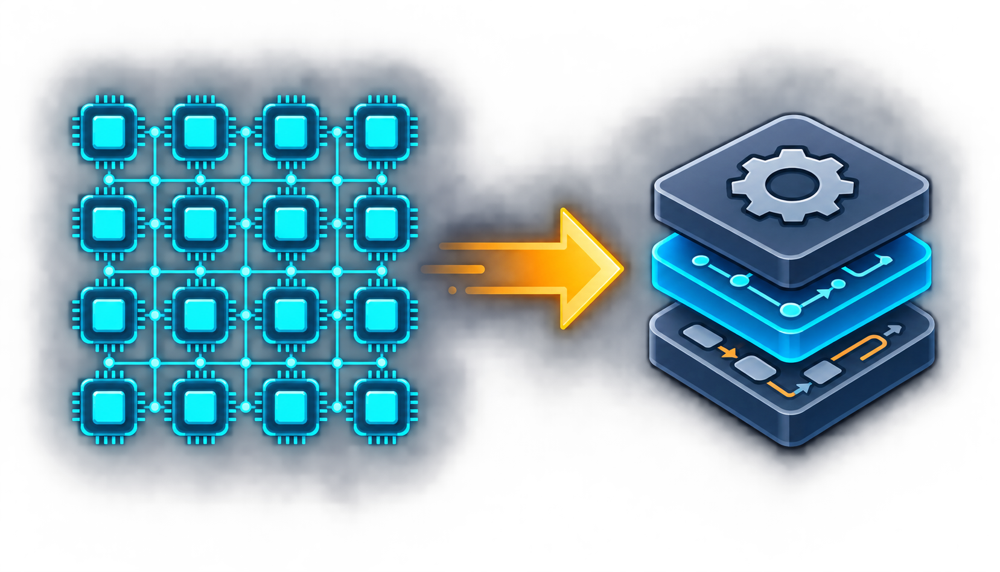

<p align="center">
  
</p>

<h1 align="center">Wafer Compiler</h1>

<p align="center">面向 Wafer 加速器程序的 MLIR 编译器和运行时工具集</p>

Wafer Compiler 接收 PyTorch/XLA 导出的 portable StableHLO program，为单卡 16-Tile 设备生成经过验证的可执行 package。
仓库包含编译器、目标代码生成、package 工具、主机验证、功能模型和板端运行时适配器。

生产编译入口提供两种策略：

- `none`：运行确定性的 baseline；
- `search`：基于 current IR 评估 physical-dataflow 候选。

两种策略使用同一套 lowering 和 package 路径，不互相 fallback。当前任务和设备资格状态记录在
[`tasks/progress.md`](tasks/progress.md)，不在 README 中重复维护。

## 总览


图中的 `none` 和 `search` 是两个独立的 current-IR transaction：它们从同一个 verified TensorProgram 出发，分别物化和验证自己的
TileRegion、Instr 和 DeviceExecutable，然后使用同一套 target/package 实现。Topology、target facts、ProgramData 和 bindings 是显式输入，
不是从名称、shape 或旁路 plan 推导出来的。

编译器按一组经过 verifier 检查的 IR 边界组织：

1. 前端验证 program directory、metadata 和 payload。
2. SPMD 阶段生成 card-local StableHLO program。
3. StableHLO 合法化为结构化 Linalg/Tensor IR，并在此完成结构化图清理和 attention 归一化。
4. `none` 或 `search` 物化 TileRegion IR，执行 temporal tiling/fusion、attention state lowering、layout resolution、movement 和 execution structure。
5. TileRegion IR 转换为 Instr IR；在进入 target lowering 前检查 completion、SPM/DDR placement 和 transport。
6. target 和 package 阶段生成一个 `DeviceExecutable` 以及一个严格验证的 `ExecutablePackage`。

Transformation choice 与物化 IR 后才能确定的事实分开保存。Search state、cost 和被拒绝的候选不会写入 IR 或 package 文件。

## 快速开始

### 准备依赖

固定版本依赖和可选组件见 [`third_party/README.md`](third_party/README.md)。完整开发环境可以执行：

```bash
git submodule update --init --recursive
python3 utils/deps/bootstrap_deps.py --all
```

如果依赖已经准备好，可以直接配置仓库。

### 配置和构建

仓库只使用一个 canonical Ninja build 目录：`build/`。

```bash
cmake --preset default
cmake --build --preset default -j"$(nproc)"
```

default preset 打开 compiler、importer、SPMD、target numeric backend、功能模型和本地测试；board SDK 集成和真实设备执行需要显式配置。

### 导出并编译程序

Python 前端负责写出 compiler 使用的 program directory：

```python
from wafer.frontend import export_pytorch_program

export_pytorch_program(module, example_inputs, output_directory)
```

使用 production driver 编译：

```bash
build/bin/wafer-compile \
  --input-program-dir <program-directory> \
  --output-dir <package-directory> \
  --num-partitions 1 \
  --optimization-policy search
```

使用 `--optimization-policy none` 选择 deterministic baseline。`search` 可以用 `--search-width` 和 `--search-trials` 限制搜索工作量。
`--compile-timing`、`--dump-compiler-ir` 和 `--profile` 是诊断或资格选项，仍然复用同一个 compiler transaction。

## 验证和运行 package

no-card 验证会检查 package、launch contract、memory plan 和 transport binding，但不会调用设备 provider：

```bash
build/bin/wafer-run \
  --package-dir <package-directory> \
  --no-card
```

board 执行使用同一个已验证 package，并要求显式设备资格、输入资源和 expected output。default build 不注册 board execution test。

`wafer-opt` 用于本地 MLIR registered pipeline 和 FileCheck case。`wafer-verify-program` 用于验证 source program directory。
两者都不是第二个 production compiler。

## 目录结构

| 目录 | 责任 |
| --- | --- |
| `include/Wafer/IR`, `lib/Wafer/IR` | Dialect、ODS、interface 和 verifier |
| `include/Wafer/Analysis`, `lib/Wafer/Analysis` | 针对 current IR 的只读 analysis |
| `include/Wafer/Planning`, `lib/Wafer/Planning` | tiling、region、layout 和 search choice |
| `lib/Wafer/Transforms` | IR 变换、layout、movement、memory 和 completion |
| `lib/Wafer/Conversion` | StableHLO→Linalg、Tile→Instr 和 Instr→LLVM conversion |
| `lib/Wafer/CodeGen`, `lib/Wafer/Target` | Device executable、target module 和 target contract |
| `lib/Wafer/Frontend`, `lib/Wafer/Driver` | 输入导入、transaction 和 pipeline 编排 |
| `lib/Wafer/Package`, `lib/Wafer/Runtime` | package schema、readback 和 invocation lifecycle |
| `lib/Wafer/Simulator` | Reference、oneDNN 和 SystemC 功能模型 |
| `tools/` | compiler、optimizer、verifier、runner 和辅助工具 |
| `test/`, `unittests/` | lit、integration、host/no-card、unit 和 board contract 测试 |
| `tasks/`, `docs/`, `memory/` | 设计合同、硬件事实和开发方法 |

## 测试

```bash
ctest --preset default -j"$(nproc)"
cmake --build --preset default --target check-wafer -j"$(nproc)"
python3 -B utils/checks/check_source_organization.py --root .
python3 -B utils/checks/check_ir_organization.py --root .
python3 -B utils/checks/check_deps.py
```

IR 变换测试使用接近生产的 static rank，并覆盖整除和 tail 维度。通过条件不仅是命令返回成功，还必须检查本阶段结果、owner
和直接下游 witness；skip、unsupported 和未注册 case 不计入覆盖率。

## 当前范围

- 单卡、一个 logical card partition 和 16 个 Tile；
- static ranked program boundary；
- PyTorch/XLA portable StableHLO 导入；
- structured normalization、FA/FD attention lowering、TileRegion 物化、layout/bufferization、movement、Instr、
  target module、package assembly 和 no-card 验证；
- cross-card transport、dynamic-ranked program、resident execution、MoE 和 persistent weight cache 不在当前 production 范围内。

## 文档

- [`AGENTS.md`](AGENTS.md)：开发流程和 compiler 工程规则；
- [`tasks/progress.md`](tasks/progress.md)：当前任务队列和依赖关系；
- [`tasks/README.md`](tasks/README.md)：编号设计文档和 archive 索引；
- [`tasks/01-architecture.md`](tasks/01-architecture.md)：pipeline 和 artifact ownership；
- [`tasks/06-physical-dataflow-synthesis.md`](tasks/06-physical-dataflow-synthesis.md)：physical-dataflow 合同；
- [`tasks/16-verification-contract.md`](tasks/16-verification-contract.md)：验证层级和资格门禁；
- [`tasks/18-source-organization.md`](tasks/18-source-organization.md) 和 [`tasks/19-mlir-engineering.md`](tasks/19-mlir-engineering.md)：源码和 MLIR 组织；
- [`memory/general_dev.md`](memory/general_dev.md)：构建、调试和验证方法。

## 相关项目

- [LLVM](https://github.com/llvm/llvm-project)
- [MLIR](https://mlir.llvm.org/)
- [StableHLO](https://github.com/openxla/stablehlo)
- [OpenXLA XLA](https://github.com/openxla/xla)
- [PyTorch/XLA](https://github.com/pytorch/xla)
- [IREE](https://github.com/iree-org/iree)
