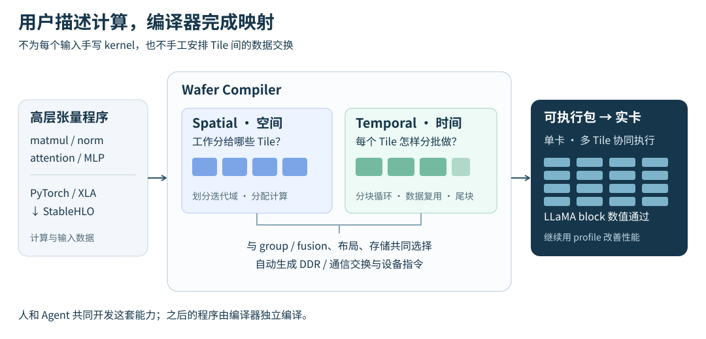
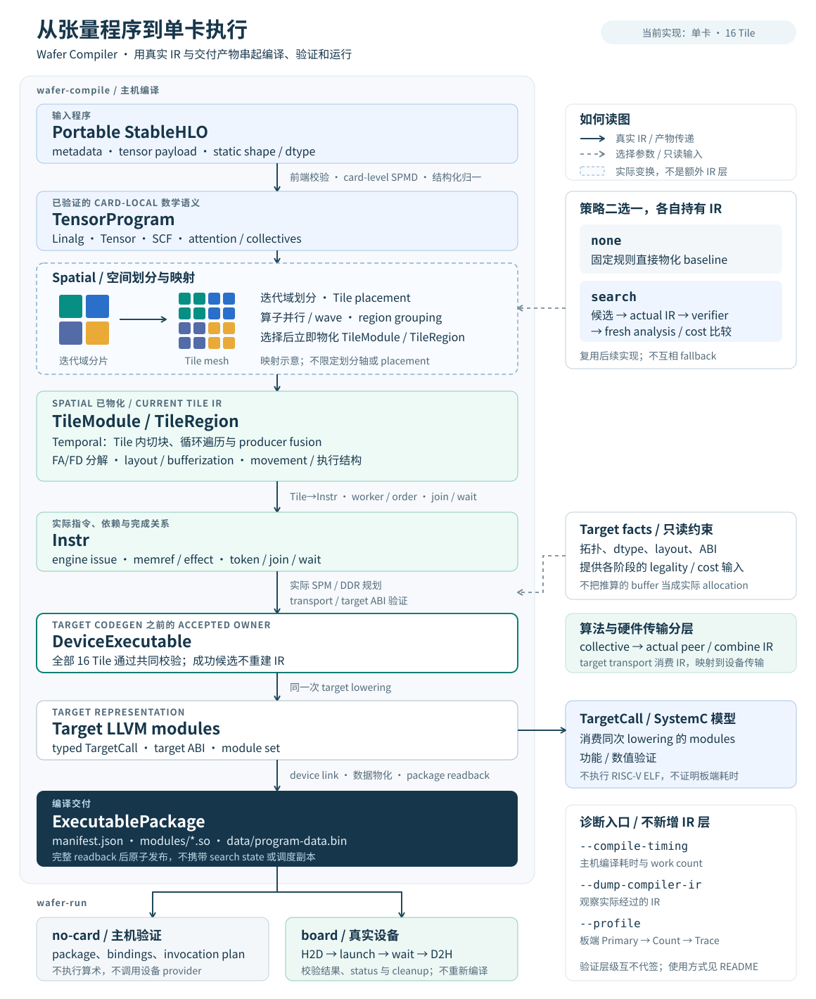
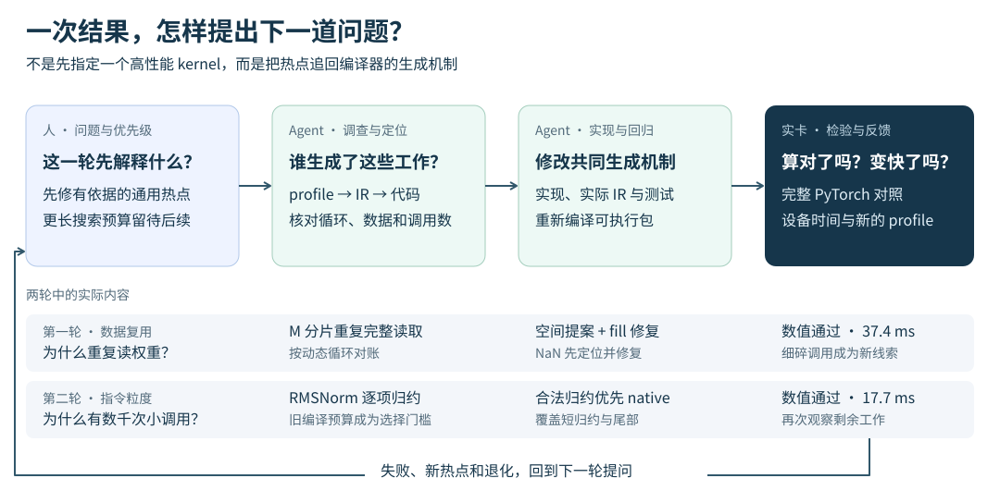

# 和 Agent 一起造编译器

*从任务组织、架构重构，到自动 spatial/temporal mapping 与 LLaMA block 实卡优化*

## 1. 开篇：我们一起做出了什么？

给编译器一个高层张量程序，不替它写 kernel，不告诉它每个计算单元该做哪部分工作，也不手工安排数据搬运。它能不能自己把这些事情做完，在一种新的加速器上跑起一个完整的 LLaMA block？

这是 Wafer Compiler 要回答的问题，也是我和编程 Agent 一起推进了几个月的项目。

现在，这条链路已经在实卡上走通：从 PyTorch/XLA 导出的 StableHLO 程序出发，编译器自动完成单卡内的计算划分、循环与融合、数据布局、存储和通信安排，生成设备指令与可执行包，再由 runtime 执行。一个 LLaMA2-7B 配置的完整 decoder block 已通过全量 PyTorch 数值对照。实卡性能优化仍在继续。

理解这件事，不需要先熟悉芯片指令集。可以把设备上的 Tile 看作一个个带有局部存储的计算单元。编译器要同时回答两组问题：**工作怎样分给不同 Tile，以及每个 Tile 内的工作怎样分批完成。** 前者是 spatial mapping，后者是 temporal mapping。布局、融合和数据交换把两者连接起来。



用户写的是计算本身；在当前支持的静态张量语义和硬件能力范围内，把计算变成可执行数据流的工作交给编译器。它不是一组为展示模型手写的算子拼接，也不是每次编译都让语言模型现场生成 kernel：**Agent 帮我们开发编译器，编译器独立服务之后的程序。**

这个结果当然让人兴奋。但在技术分享中，大家问得最多的，往往不是某个 pass 如何实现，而是：

- 你到底把什么任务交给 Agent？它能自己推进到哪一步？
- 做这么久，它怎么接得上之前的工作？
- 新硬件没有现成答案，谁来判断它的设计是不是靠谱？
- 它出过什么问题？人又在哪些地方帮了忙，或者帮了倒忙？

这篇文章就沿着这些问题展开。先讲我们怎样一起工作，再讲这种协作怎样塑造编译器，最后进入一次完整的实卡优化现场。

## 2. 起点：新硬件，以及我们各自带来了什么

### 2.1 有基础设施，但没有一条现成的目标编译链

“从零做编译器”很容易让人误解成一切都自己重写。我们的起点并非如此：有硬件资料和设备 SDK，有 MLIR、XLA 等基础设施，也有 PyTorch 可以提供数学参考。我们复用这些已有工作，在其上建立面向目标设备的编译体系。

真正需要补上的，是高层程序与硬件执行之间的那一大段距离。

矩阵乘法的数学定义不会告诉我们，权重应该由哪些 Tile 读取；芯片支持一种通信操作，也不会自动给出整张图的数据交换策略。一个硬件调用返回了，哪些资源可以复用、哪些结果还需要等待，同样要落实为编译器和 runtime 能够共同理解的规则。

其中一部分答案在资料里，一部分要沿 SDK 和实际实现查证，还有一部分需要编写小实验上板确认。我们一边写编译器，一边把这些事实整理成可以被代码消费的目标模型。

这也是它与近期公开的 Agent compiler 项目值得对照的地方。Anthropic 的 C compiler 实验以编译 Linux 为目标，并通过 GCC 对照等反馈机制支撑长时间自主开发。[官方复盘](https://www.anthropic.com/engineering/building-c-compiler) Kimi 的 MiniTriton 则沿用 Triton 风格的编程模型，构建 DSL、MLIR、PTX 和 runtime 链路；仓库也明确记录了维护者的工程指导与审查。[官方介绍](https://www.kimi.com/en/blog/kimi-k3)、[项目说明](https://github.com/MoonshotAI/minitriton)

我们的不同之处，是既要让编译器从高层图自动决定映射，又要面向新的多 Tile 执行体系建立目标语义。PyTorch 能告诉我们结果应该是什么，却不能给出这张芯片上的参考指令序列和资源生命周期。

这不是一场可以直接比较难度或模型排名的比赛。它提出了另一个很实际的问题：**当验收环境和问题定义本身也在成长时，人和 Agent 怎样共同推进？**

### 2.2 人不是完整规格的提供者，Agent 也不是打字员

我带来了项目目标、硬件背景和对编译器通用性的要求，也负责在讨论中判断哪些能力值得做、哪些假设不能接受。但我并没有预先给出一份完整正确的架构，让 Agent 照着实现。

Agent 的贡献远超补全函数：它阅读代码和资料，比较算法，提出设计，跨 IR（编译器的中间表示）、后端、runtime 和测试实施修改，也沿失败结果继续定位。许多细节是在它拿出代码、反例或实验后，我们才真正看清楚的。

这种分工是流动的。有时我指出它把问题定义窄了，它重新调研；有时它发现一个下游限制，我们一起修改原先的方案。设计和实现不是分别属于某一方，而是在往返中逐渐收敛。

当然，这个往返也并不总是顺利。我会把“继续”“做得通用一点”当成足够清楚的要求；Agent 会把一份结构完整的计划误当成合理的设计，把局部测试通过写成过于乐观的完成总结。后面几轮重构，既是在改编译器，也是在修正这套合作方式。

## 3. 我们具体怎样让 Agent 干活？

### 3.1 工作台：对话提出问题，仓库承接工作

实际工作台并不神秘：一个能读写仓库、运行终端工具的编程 Agent，一套可重复执行的构建与测试入口，以及代码、设计文档、Git 和实验记录。

对话负责提出问题和讨论取舍；实现过程发生在仓库里。Agent 可以查调用链、修改相关模块、补测试、运行检查，再把结果带回讨论。我们不需要在聊天窗口里来回搬运大段源码，也不按“一次回答生成了多少行代码”计算进度。

拿最近一次任务来说：编译器已经能处理一些 attention 和矩阵乘法的分块，但我们继续要求把 temporal 分块与融合推进为静态计算的共用能力，覆盖普通归约、卷积、逐元素链、view 和多结果状态。这个任务有两轮相连的提交：先补齐通用融合机制，再统一需求分析。

如果只告诉 Agent“把它写得 general 一点”，很可能得到一个名字更通用、内部仍然分别处理各种特例的接口。我们需要把“通用”翻译成它可以实施、我们也能判断的具体问题。

### 3.2 把愿望变成一张可以开工的任务卡

这轮任务的核心问题是：**当消费者只需要一块输出时，怎样知道上游需要计算哪些数据？**

对逐元素运算，这往往就是对应的一块输入；对归约，还需要沿归约维完成累加；对卷积，需要考虑窗口；经过 reshape 后，同一份数据又可能换了一套坐标。我们要复用的是这些访问关系，而不是给每种算子另写一份切块流程。

下面是根据[实际实施计划](../../tasks/plans/board-performance-optimization.md)整理的任务卡，不是对话逐字稿：

```text
目标
  统一静态计算的 temporal 需求与复用分析，覆盖 GEMM 之外的输入。

从哪里开始
  读取当前索引关系分析、temporal 选择与物化代码；
  找出 direct、view、shared、broadcast、window 路径的重复判断。

要交付什么
  一套共用的精确需求查询，以及直接消费它的分块与融合实现；
  保留 producer 内部归约需要的自由参数。

怎样验收
  覆盖整除与尾块、共享 producer、窗口与 view 组合；
  检查实际元素覆盖、producer 生成次数和最终片上内存规划；
  从新鲜 PyTorch 输入重新编译并通过 no-card。

本轮边界
  不改数值语义，不运行实卡，不把片上容量问题转成估算放行。
  现有接口和代码能确定的细节自行处理，改变设计方向时再讨论。
```

这张卡没有指定每个函数怎么写。它固定了要解决的问题、允许改变的范围和交付结果，把实现空间留给 Agent。

### 3.3 Agent 拿回来的，不应该只是“我改好了”

这轮工作的实现可以沿着三个层次来看。

首先是调查与建模。旧代码对 broadcast 和 window 分别维护需求判断；direct、view 和 shared 路径又各有关系证明。新实现把这些判断接入共同的 `IndexRelation`，回答一个输出块对应哪些输入位置、哪些坐标变化不影响需求，以及不同块的需求是否重叠。

然后是把分析接入真正的变换。只增加一个通用查询函数没有用；原来的 direct、view、共享 producer、broadcast/window 路径要改为消费它。分析回答“需要什么”，变换负责“生成什么”。矩阵乘法和归约还要保留输出坐标无法确定的内部归约分块，不能因为 consumer 的输出块已经确定，就误以为 producer 的所有循环都确定了。

最后是让测试观察新抽象的实际作用。比如，把卷积输入的某段计算提到不变循环之外，测试就要检查它确实只生成一次；处理尾块，测试就要检查输出完整且没有重复。这样才能区别“接口换了名字”和“多个场景真正共用了一套机制”。

这轮交付留下了可以逐层阅读的工件：

| 想了解的问题 | 可以直接看的结果 |
| --- | --- |
| 输入访问关系怎样统一？ | [`TensorResultIndexing`](../../include/Wafer/Analysis/Linalg/TensorResultIndexing.h) 的共同入口 |
| 一个网格中所有块的需求怎样查询？ | [`IndexRelation`](../../include/Wafer/Analysis/Linalg/IndexRelation.h) 的 `getRectangularTileImage` |
| 谁使用查询结果选择融合？ | [`TemporalDomain.cpp`](../../lib/Wafer/Planning/PhysicalDataflow/TemporalDomain.cpp) |
| 循环、局部计算和共享结果在哪里生成？ | [`TemporalTiling.cpp`](../../lib/Wafer/Transforms/Linalg/TemporalTiling.cpp) |
| 这轮改动经过什么验证？ | [计划中的输入矩阵与本轮结果](../../tasks/plans/board-performance-optimization.md) |

在这次实现中，还出现了一个算法效率问题：如果逐个枚举所有 tile 来证明需求，输入越大，编译工作越多。最终查询对主块和尾块类型作参数化证明；相应测试把长度扩大到百万级，检查的类别仍维持在 2、4、8 这样的量级，而不是随 tile 数逐一展开。

这类工作体现了 Agent 很有价值的一面：它可以把一个跨分析、选择、变换、测试的设计推进成完整修改，而不要求人逐文件分派。

### 3.4 一轮结束，怎样接到下一轮？

两轮提交分别保留了通用融合与统一关系分析的结果。最新一轮增加的 12 组卷积/view 组合用例，实际走到了指令和片上内存规划；11 个新鲜 PyTorch source→package→no-card case 也完成了验证。提交 `ba976c5a`、`d2438ce1` 和实施计划记录了这段工作。

到这里，我们可以接受这轮主机侧交付，继续推进设备性能任务，而不是让 Agent 一直追着“整个编译器是不是完美”打转。No-card 在这里检查可执行包与调用计划，不运行设备算术；新版本的实卡表现留给后续实验回答。

回看完整循环，它不是“我给精确指令，它执行”，而是：**我提出想改善的能力，Agent 把问题展开为设计和代码，我们用直接结果修正理解，再确定下一步。**

## 4. 怎样让协作持续数月，而不是只完成一个任务？

### 4.1 下一轮接手的，是工程状态，不是一长串聊天

Git 中能看到 5 月的设计与骨架、7 月的架构重基线、8 月下旬的集中重构，以及 9 月的实卡验证。这不是一个从未中断、从未丢失上下文的长会话。

我们逐渐把下一轮需要的信息分开保存：`AGENTS.md` 放长期协作规则；编号设计文档解释当前架构；`tasks/progress.md` 告诉 Agent 正在做什么；实施计划保存这项任务的步骤和验收；`memory/` 留下已验证的根因与调试方法；Git 和实验记录保存变化本身。

于是，“继续”不再只是依赖它记住上次说到哪里。下一轮先定位当前任务，再读取相关设计和代码，便能接着做。它遇到新的反例，也有地方写回，而不是只在最后一句总结里提一下。

但文档本身也会制造错误的连续性。2026 年 7 月的一次审计发现，几份庞大的计划引用了大量还不存在的路径，很多设计对象没有生产实现。文字已经形成一座完整的建筑，代码却还没有走到那里。[审计记录](../../tasks/archive/12-architecture-evidence-reset.md)

后来清理文档，又一度把未完成任务的必要细节归档过头，当前计划只剩摘要，新一轮仍要翻历史才能开工。我们因此学到：上下文管理不是多写，也不是一味压缩，而是让接手者能够分清**现在是什么、为什么这样、接下来要改变什么**。

### 4.2 最需要人介入的，有时是它回答了另一个问题

一次 review 中，我希望 Agent 判断整个框架的抽象和算法是否合理、通用、高效。它却主要沿着现有实现寻找 bug，修了几个问题，再给出相当积极的结论。

我当时的反馈很直接：

> 没有针对各个模块，各个核心算法是不是合理，是不是足够通用且高效给出你的判断。

这不是要求它再多找几个 bug，而是要求改变审查对象。局部实现可以是正确的，分层却仍然不合理；某个模型可以通过，算法也可能只适用于碰巧出现的形状。

讨论随后转向了更具体的追问：FA/FD 为什么被称为特殊路径？通用通信算法为什么和目标 transport 绑定？搜索里增加的对象，究竟是一个待尝试的选择，还是另一套未来程序？这些问题把 review 从“检查现有代码”推进到了“重新检查问题怎样被表达”。

这也是我对 Agent 能力边界最深的一次体会：**它能很有条理地推进工作，却可能沿着一个不该默认接受的前提推进。** 人的价值不一定是给出实现答案，也可以是发现它正在认真解决错误的问题。

### 4.3 我们两边都付过学费

Agent 的问题不只有出错，也包括过度乐观的总结、没有量化依据的优化，以及为解释旧设计继续增加抽象。我这边的问题，则是宽泛授权、过早接受“基本完成”的判断，或者把“通用”“高效”当成不需要进一步解释的要求，没有说清探索成本与交付目标如何取舍。

有一轮编译性能修改调整了候选进入后端的顺序，之后发生回退，Git 中保留了 `e54cde0c`。与此同时，反复启动重型 LLaMA 测试把反馈拖得很慢。我明确提出过：这类重型 case 应该放到最后集中验证，不能每做一点就重跑一遍。

这里需要改变的不只是执行命令。Agent 应先拿出瓶颈的工作量和阶段计时，再决定改什么；我也不能把“看上去更聪明的算法”直接当成收益。后来的若干分析复用通过了回归，却没有带来明显超出波动的提速，这同样是有用的结论。

我们也逐渐减少没有新增信息的询问。局部接口用法和测试入口可以自己查，就不必每一步等待批准；但改变数值语义、另立一套表示、扩大设备实验范围，确实需要重新讨论。自主性不是一个统一的开关，而是由任务边界决定的。

### 4.4 从“它说完成了”转向“我知道完成了哪一层”

早期审计里，一个很有冲击力的例子是：已有大量局部测试通过，候选提交却只保留了首个代表 Tile 的结果。测试覆盖到了局部计算，没有覆盖完整输出。

之后我们会要求 Agent 展示一条直接链路：输入怎样进入变换，输出由谁消费，检查究竟观察了什么。IR 在这里很重要——它把循环、数据和依赖变成双方可以检查的具体程序，而不只是口头描述。

日常工作先用小范围检查缩短反馈，再用真实规模、多块和尾部输入检验机制，最后运行必要的完整模型与实卡实验。这样，人不用逐行代替 Agent 验证全部实现，也能抓住那些决定结果的边界。

这些习惯不是项目开始前就准备好的管理方法，而是被实际问题一点点逼出来的。下一章的架构变化，正是在这样的讨论中发生的。

## 5. 几轮关键重构，怎样塑造了这个 compiler？

### 5.1 第一轮转向：搜索的是程序选择，不是另一套未来程序

搜索编译方案有一个很自然的诱惑：先用轻量对象描述未来的计算、buffer、搬运和调度，挑选之后再生成真正的 IR。这样看起来可以避免尝试每个方案的实现成本。

我们也走进过这个方向。计划对象逐层增加，后面的实现再按计划重放。两边对不上时，就补 identity 映射、预期清单和一致性检查。每一个补丁都能解释一个局部问题，整体却逐渐变成与 MLIR 并行的第二套程序表示。

在讨论后续方案时，我问过 Agent：

> 你这个改的方向会变成猜测或者发明另一套shadow plan？

这句话最终指向一个比“有没有重复结构体”更重要的边界：哪些东西只是选择，哪些东西已经在声称程序事实？选择 tile size 是合理的；在尚未生成程序时，声称某个 buffer 存在、与谁共享存储、什么时候死亡，就需要另一整套语义系统来支撑。

这轮重构把两者分开。搜索保留明确的选择参数，选择生效时就生成实际 IR；后续分析读取这份程序。失败候选被销毁，成功候选带着同一份实际程序继续交付。它不再先拿一种表示通过检查，再重放成另一份待执行程序。

例如，片上存储 SPM 是否放得下，取决于实际生成的 allocation、布局、别名和生命周期。一个按形状估出的字节数可以辅助候选排序，但真正决定容量合法性的，是该候选的实际内存规划。

Tile 级 IR 在这次转向中有了明确价值：空间划分之后，每个 Tile 上的计算、循环、数据和搬运都有实际落点，后面可以据此生成指令、安排完成关系和分配内存。它连接了高层映射与底层执行，而不只是给架构图增加一层。

Agent 承担了边界梳理和后续实现，人的关键介入则是停止让“再增加一种计划对象”成为默认答案。相关演化可以从 8 月下旬的 current-IR 重基线、空间物化和后续 lowering 提交，以及[根因记录](../../memory/bugs.md)中追踪。

这次经历让我更看重一个 review 问题：**新抽象消除了哪一种不一致，还是只给不一致再加了一个解释层？**

### 5.2 第二轮转向：从特殊路径，回到共同的计算语义

另一组讨论从两个很短的问题开始：

> FA和FD为啥是fast paths？

接着是 Ring、All-to-All：为什么通用算法会在分类中和具体目标硬件绑在一起？

问题不在英文名称，而在这种分类很容易指导后续实现：普通路径先做一套，重要模型再绕出去补一套。短期能交付示例，长期每个路径都要重新解释 shape、view、状态与通信。

我们要的则是把算法语义和目标实现分开。FlashAttention、FlashDecoding 有自己的计算结构，但它们也应该通过共同的空间、时间和存储机制实现，而不是依赖某个模型名称触发专用代码。

沿这条思路，索引关系逐渐成为几个阶段的共同语言。Transpose、reshape、broadcast 在表面上是不同操作，本质上都改变了“输出位置对应哪些输入位置”。先把关系表达清楚，图优化就不必只认识几种打印出来的固定形状，spatial 和 temporal 也能复用对数据需求的理解。

普通纯图中的相关等价变换由有界 **e-graph** 统一探索。可以把它理解为同时保留多种已证明等价的写法，再提取合适的表达，而不是由一串贪心规则的执行顺序决定最终结果。这里探索的是支持范围内的访问与结构等价关系；标量计算的含义继续由原程序决定。最终交给下游的仍是正常 IR。[图归一化设计](../../tasks/05-local-compute-normalization.md)

Attention 则先从实际数据依赖和访问关系识别出来，再表达为在线更新的状态。FlashAttention 分块维护 maximum、sum 和 accumulator，避免必须保存完整 score 矩阵；FlashDecoding 还可以形成多个 Tile 的局部贡献及其合并。随后 spatial 决定贡献放在哪里，temporal 决定每处怎样遍历和融合，再降低为普通计算与数据移动。

这里，group/region 与融合也逐渐分清：把几项工作放进同一个执行范围，不等于它们已经在同一个循环里共享数据。后者需要从消费者需求反推 producer 的局部计算，正是第 3 章那轮通用 temporal 工作继续解决的事情。

结果不是“从此没有复杂算法”，而是复杂算法拥有了可以复用的基础。E-graph、自动 spatial 划分、temporal 分块和 group 内融合也因此不再只是并列的功能名，它们通过共同语义接在了一起。

对人和 Agent 的合作而言，这种联系很重要。人的追问让它离开模型特例；Agent 再把通用性要求落实为关系分析、接口、变换和跨场景测试。架构是在这个过程中长出来的。

### 5.3 第三轮转向：先把优化问题建对，再讨论求解器够不够强

布局选择是最能说明这个问题的例子。同一份 tensor 可以采用不同物理布局，一种布局适合上游，另一种适合下游。逐算子贪心选择，很容易在中间制造反复转换；多个消费者本可共享的一次转换，也可能被各自重复生成。

我们把这类局部选择交给 **PBQP**：为值及其使用建立有限的布局选项，把计算约束和转换成本放进同一个问题里求解。它让多个相关选择一起被考虑，而不是各选各的。

但“用了 PBQP”并没有自动结束设计工作。一次实际问题是，solver 为计算结果选中了某种布局，bufferization 却给承接它的 destination 分配了另一种布局。两个本来属于同一存储关系的对象，被模型当成了可以独立选择的变量。

修复需要同时改变建模和消费：把应当绑定的 destination/result 关系纳入同一组，按真实物理映射判断 view 是否能保留布局；共享转换也按实际可共享的范围计费和生成。检查对象因此从 solver 的 assignment，延伸到真正产生的 allocation、view 和 conversion。[布局问题根因](../../memory/bugs.md)

规模上来后，另一个取舍变得明显：已有一个完整合法方案，但精确搜索还没有证明它最优，编译器该不该交付？从 8 月 30 日的精确求解门槛到 31 日的修改，代码明确区分了 `Optimal` 和 `Feasible`。后者携带经过约束检查的合法解，只是不声称本轮已经证明最优；预算耗尽也不再等同于问题无解。[Solver 合同](../../lib/Wafer/Planning/PhysicalDataflow/ExactPBQPSolver.h)

回头看，这也修正了我们在提要求时容易混在一起的三件事：正确性要求、优化目标、计算预算。Agent 可以实现一个很强的求解器，但如果我们把“希望更优”写成“否则程序不合法”，更强的求解器未必能解决产品问题。

外层的联合搜索也遵循这个区分。空间切分会改变每个 Tile 的输入需求；region 组合和 temporal 融合会改变数据复用与驻留；布局和通信又影响最终成本。我们让这些选择在同一候选实现链上相互反馈，而不是独立调完几个旋钮再拼接。PBQP 负责候选内的布局子问题，外层在给定预算内比较实际生成的方案。

对于已支持的数据交换边界，DDR 与 peer communication 都可以形成候选；Ring、recursive doubling、All-to-All 等算法先生成具体参与者间的数据流，再交给目标 transport 实现。这样，应用开发者不用手写每种划分对应的通信，算法本身也不被某一种芯片传输 API 定义。[通信设计](../../tasks/13-communication.md)

这还不是对所有候选的穷尽搜索。它的价值，是把更多原本需要人写 kernel 和安排映射的决策，变成编译器能够表达、实现和比较的选择。哪些选择最有价值，最后仍要让真实程序来回答。

<details>
<summary>技术侧栏：这些设计在完整编译架构中的位置</summary>



上层处理计算与访问语义；空间物化后，在实际 Tile 程序上逐步完成 temporal、layout、movement 与指令生成；最终形成全部 Tile 的可执行程序和 runtime 消费的 package。详细职责见[架构设计](../../tasks/01-architecture.md)。

</details>

## 6. 主案例：Agent 怎样依据 profile，把 LLaMA block 从约 109 ms 优化到 17.7 ms？

前面的协作方式，在实卡上有了更直接的反馈：代码里看起来合理的选择，究竟让设备做了什么？

我们没有先给 Agent 指定一个待实现的“高性能 LLaMA kernel”。任务是分析真实 profile，回到编译器找到生成原因，再修改通用机制。性能记录保留了从问题收窄到两轮修改的过程。

### 6.1 先让 Agent 解释程序，而不是立刻提出优化

实验对象是 LLaMA2-7B 配置的一个完整 decoder block，FP16 输入 `[1,16,4096]`，MLP 中间维度 11008，固定 seed 初始化输入和权重，使用 Hugging Face 层构造与 PyTorch eager reference。这里运行的是一个 block，不是整套网络的预训练推理。[输入构造](../../test/Board/PyTorch/wafer_pytorch_board_cases.py)

初始设备时间约 109 ms。继续讨论时，有几个看似基础的问题需要 Agent 用实际程序回答：搜索日志只有一个 spatial state，是否意味着只用了一个 Tile？时间花在计算、搬运还是等待？这个 block 是否真的识别成了 FlashAttention？

查看所有 Tile 的 IR 后，答案具体了：16 个 Tile 都在做事，但搜索当时只访问了一套空间方案；attention 仍是普通的矩阵乘法与 softmax 图。再把 profile 与动态指令次数对上，重复权重读取和细碎调用成为了可追踪的线索。

这些追问改变了任务的走向。我们不再泛泛地“增加并行”或“减少同步”，而是要求解释当前并行方案为什么搬运这么多数据、细碎指令又是谁生成的。后续按已确认的热点推进，更长搜索预算的比较被明确留到后面。

### 6.2 第一轮：把“搬运很慢”变成一个空间划分问题

Agent 沿实际循环统计后发现：7 个 projection/MLP GEMM 都把 `M=16` 按行分给 16 个 Tile。每个 Tile 处理一行输入，却需要读取完整权重。

一个 `[4096,4096]` 的 FP16 权重矩阵为 32 MiB，16 个 Tile 各读一次就是 512 MiB 的逻辑请求。整个 block 的权重读取约占当时逻辑 DDR 读请求的 99.16%。这不是 DRAM 总线测量值，却足以解释生成程序中的重复工作。

调查落到了 spatial proposal：旧提案偏向按轴顺序产生切分，没有充分利用 operand 访问关系中的复用信息。我们随后让修改从这些关系提出低重复读取的方案，并沿上下游协调 partition 和初始化，而不是给这个 LLaMA shape 写固定映射。

第一轮实测很快到了约 37 ms，但输出的 65,536 个元素全部是 NaN。

这时要做的已经不是继续追求更短时间，而是定位为什么新划分算错。实际指令暴露了一个初始化问题：目标 view 是 16 行、每行 256 个元素，行跨度为 4096；旧 fill lowering 却把它当成连续的 4096 个元素清零，写进了行间空隙，也漏掉了应该初始化的位置。

修复依据真实 stride 分解 logical fill，相关测试检查目标位置恰好覆盖一次、空隙不被修改。重新编译并通过完整数值对照后，有效的 profile Primary 为 **37.436001 ms**；逻辑 DDR 读请求从约 6.53 GB 降到 0.474 GB。[失败记录](../data/board-performance/llama-spatial-failure-20260909.json)、[修复后复验](../data/board-performance/llama-spatial-fill-20260909.json)

这轮有价值的地方，不只是一个更好的切分。新的空间方案把旧初始化实现的隐含假设暴露出来，Agent 又沿真实产物将修复落回了通用 lowering。优化、发现旧问题、修复共用机制，实际上发生在同一条工作链里。

### 6.3 第二轮：profile 把问题从数据量推到了指令粒度

我们继续看新 profile，没有沿用“主要是重复读权重”的旧解释。

Tile14 仍有 10,317 次 GatherScatter 和 8,434 次逐元素 add，而显式 NCC join 只有 13 次。Agent 沿调用和循环追到两个 RMSNorm：每处在每个 Tile 上归约 8 个 512 元素块，旧 lowering 把每块展开为逐项搬运与标量累加。两处合起来就能解释 8192 次这类操作。

为什么不用硬件已有的 native reduction？进一步读选择逻辑，发现一个来自旧编译展开预算的长度门槛。这个数字本来限制编译工作量，后来却左右了原生归约是否被采用。

修复因此很明确：满足已有 init、axis、dtype、rank 和结果布局条件时优先 native，删除这道没有硬件性能依据的长度门槛。Agent 同时补齐短归约、旧阈值两侧和尾部等输入，检查生成的是原生归约，结果搬运也保持完整。

再次实测并通过 PyTorch 比较后，profile Primary 到了 **17.677999 ms**。GS 从 10,317 次降到 1,997 次，add 从 8,434 次降到 178 次；DDR 请求量和 13 次 join 都没变。程序变化与观测一致地指向：这轮主要消除了细碎归约及其控制、提交开销。[归约实验记录](../data/board-performance/llama-native-reduce-20260909.json)

人的作用是持续追问热点的生成原因，并安排先做哪项可解释的修改；Agent 的作用是把问题从报告一路追到 IR、循环和 lowering，再跨代码与测试完成改动。双方都不需要在最初就知道最后会删掉哪一个条件。



### 6.4 把结果放回同一个口径

下表比较同一输入、同一设备会话内，profile 流程中未插桩的 Primary 设备时间，每阶段各一个样本：

| 阶段 | 设备时间 | 主要程序变化 |
| --- | ---: | --- |
| 初始版本 | 109.008003 ms | 按 M 切分，多个 Tile 重复读取权重 |
| 空间复用与 fill 修复后 | 37.436001 ms | 逻辑 DDR 读取约 6.53 GB → 0.474 GB |
| 合法归约优先 native | 17.677999 ms | 大量逐项搬运和累加被原生归约替代 |

这组三阶段观测对应约 **6.17×** 加速、**83.8%** 的设备时间下降。它们保持相同输入、未融合 attention 实现和数值策略；65,536 个输出均通过 `rtol=0.002`、`atol=0.004` 的完整对照，最大绝对误差均为 0.00146484375。全 NaN 的快速样本不计入有效结果。这里报告阶段观测，不把单样本称为稳定均值，也不把收益归因于尚未用于这组 A/B 的 FlashAttention。

Primary 用来比较设备时间，另行采集的 engine PMU 与本地 Trace 用来定位；三者不是可以相加减的同一份时间分解。输入、产物身份和详细计数可从[基线](../data/board-performance/llama-block-profile-20260909.json)及[完整性能记录](../board-performance-results.md)核对。

对于协作方法，更值得注意的是这个循环会自己提出下一道具体问题：空间复用改善后，细碎归约显露出来；归约改善后，再去看剩下的搬运与依赖。Profile 不只是文章最后的一张成绩单，它在持续决定 Agent 下一轮应该调查什么。

## 7. 收益之外：哪些结果提醒我们仍需继续？

### 7.1 Decode 的退化，让通用优化接受其他程序的检验

较早一轮 decode 优化把单步 Primary 从 11.272 ms 降到 8.198 ms。我们沿 Trace 发现远端归约状态接收得过早，串行化了本可并行的本地计算；修改将接收放到实际使用附近，同时改进共享 mask 访问，保留必要等待。

但后续组合修改下，同类输入又测到了 11.443 ms。数值与历史 KV prefix 检查仍然通过，性能却退化了。新热点涉及 DDR acquire 和所选 partition，需要继续追查。[Decode 记录](../board-performance-results.md)

这会直接改变后续协作：LLaMA block 上的收益不能让一个通用修改自动毕业，另一个消费者提供了新的问题。它也要求我们保留历史结果，避免每轮只记住最好看的那一个数字。

### 7.2 Prefill 的收获，是让一种真实规模输入可以运行

4K、32-head prefill 曾因每 Tile 保留完整 accumulator、仅这一项就占 2 MiB 而无法通过 SPM 规划。继续缩小计算块没有解决问题，因为完整状态仍跨越两轮遍历存活。

修复把状态 producer 与归一化 consumer 放到共同的输出块循环里：每块完成全部 K/V recurrence，立即归一化并写出。Accumulator 缩到 64 KiB，完整输出留在 DDR。随后，16,777,216 个输出通过了实卡 PyTorch 比较，单次 Primary 为 913.580017 ms。[Prefill 记录](../data/board-performance/prefill-local-state-20260909.json)

这是一项从不能运行到能够运行的成果，没有同 shape 的优化前设备时间可计算加速比。它也让我们看到，仅处理 attention 的局部状态还不够，后续应继续把相同需求推广到一般归约、view 和多结果融合——第 3 章的工作正是在这条线上推进的。

### 7.3 工程在继续，已有成果不等于探索已经结束

新的通用 temporal 与索引关系实现已完成主机和 fresh no-card 验证；融合 LLaMA 的实卡 A/B、decode 退化，以及更充分的候选比较，仍是后续问题。

自动选择也有实际覆盖范围。例如，上述 LLaMA 版本还没有完整枚举“外部权重先读入某个 Tile、再通信分发”的方案。最终采用 DDR，不能说明所有共享方案都已经参加过比较。

这不是把项目退回起点。能够导出真实程序、生成全部 Tile 的指令、执行模型并把 profile 追回通用实现，已经让后续问题从“我们能不能做出来”，变成了“哪一项新的机制或选择最值得继续投入”。

## 8. 其他团队可以怎样复用这套方法？

如果重新开始，我不会先要求 Agent 写一份覆盖所有未来能力的总体规划。我会按下面的顺序建立工作台，每一步都留下下一步能直接使用的东西。

**第一步，准备一个能裁决结果的起点。** 给 Agent 一个真实输入、独立的数值 reference、最小硬件资料和可执行的构建命令。让它整理哪些行为已有依据、哪些需要实验。这一步的产物是一条可以开始实现的最小纵向任务，而不是一张很大的功能清单。

**第二步，先贯通一个输入到执行的链路。** 选择一个能覆盖关键数据与执行路径的 case，让 Agent 完成从 source、IR、package 到运行与对照。人主要审查跨层语义：上层的输出是否真被下层使用，参考结果是否独立。先拥有这条链，后续设计才有现实的落点。

**第三步，把下一项能力交成一个完整问题。** 用第 3 章的任务卡描述目标、现状、范围、验收和自主边界，让 Agent 先调查和比较方案，再实现。不要代它指定每个文件；也不要只给“更快、更通用”几个形容词。要求它展示为什么这个抽象能够覆盖几类不同输入。

**第四步，在重复问题出现时切换审查层级。** 如果增加一种输入总要多加一条特判，或者几个阶段不断重新猜同一件事，就让 Agent 暂停局部修补，审查共同语义和职责。我们对 shadow plan、访问关系和 PBQP 建模的讨论，都是在这一层发生的。人的技术判断在这里尤其值得投入。

**第五步，把每轮发现接回工程。** 代码修改留下回归，推翻的假设更新设计，当前进度写回任务，已经完成或放弃的方案退出当前上下文。下一轮让 Agent 从这些工件恢复工作，而不是让人重复讲述整个项目。

**第六步，让真实负载决定优化顺序。** 拿到 profile 后，先让 Agent 解释当前程序为何产生热点，再授权修改共同生成机制。数值、耗时、退化和没有收益的尝试都进入记录。人的介入逐渐从“接下来写什么”转向“哪一个问题值得先解决、现有解释是否站得住”。

这套方法并不要求人预先知道所有答案。它要求人愿意参与问题定义，也要求 Agent 把想法变成可以讨论、执行和检验的产物。Agent 最有价值的能力，是迅速展开并完成大量相互关联的工程工作；它最需要外部纠正的地方，则是默认前提、目标漂移，以及对完成程度的判断。

对我来说，这个项目最重要的变化，是我们真的能以这样的协作方式触及一整套编译体系：讨论 e-graph 和 PBQP 的建模，重构空间与时间映射，自动生成数据流与指令，再拿真实芯片上的模型结果回来继续修改。

完整 LLaMA block 跑通不是这个故事的句号。它让合作进入了下一个阶段：**人和 Agent 不再围绕“看起来合理的编译器”讨论，而是共同改进一个已经在硬件上工作的系统。**

---

### 材料与版本说明

本文按项目推进者的第一人称整理，“我们”指人与编程 Agent 的协作。引用的问题来自开发对话，任务卡是依据实施记录的重述；过程材料包括代码、设计、Git 历史和实验记录。实现复盘截至 `d2438ce1`（2026-09-10），性能数字分别对应文中链接的实验产物。

- [项目入口](../../README.md)、[架构设计](../../tasks/01-architecture.md)、[当前任务状态](../../tasks/progress.md)。
- 主要重构线索：7 月的[事实重基线审计](../../tasks/archive/12-architecture-evidence-reset.md)；8 月的[图归一化](../../tasks/05-local-compute-normalization.md)与[physical-dataflow 设计](../../tasks/06-physical-dataflow-synthesis.md)；9 月的[temporal 实施与验证记录](../../tasks/plans/board-performance-optimization.md)。
- 相关提交：`dd738a9c`（架构审计）、`c6cc4d57`（current IR 原则）、`2aa64117`（e-graph 实现）、`41cbe267`（PBQP 唯一布局入口）、`cd6817e4`（合法布局解）、`92d0be9e`（模型流量与原生归约）、`ba976c5a` / `d2438ce1`（通用 temporal 与需求分析）。
- [实卡正确性记录](../../tasks/archive/board-correctness-qualification.md)、[性能测量与根因](../board-performance-results.md)，以及其中链接的机器可读实验摘要。
