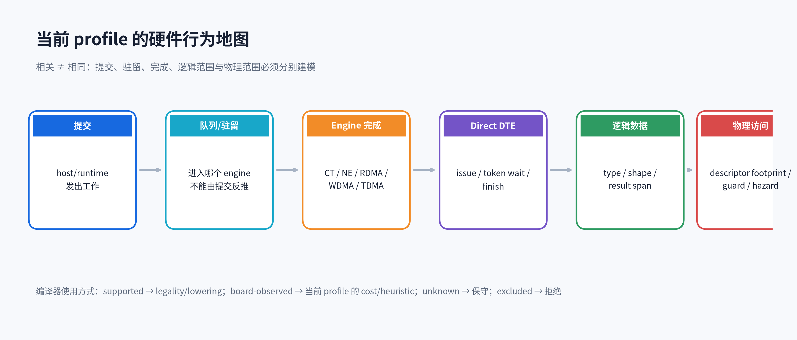
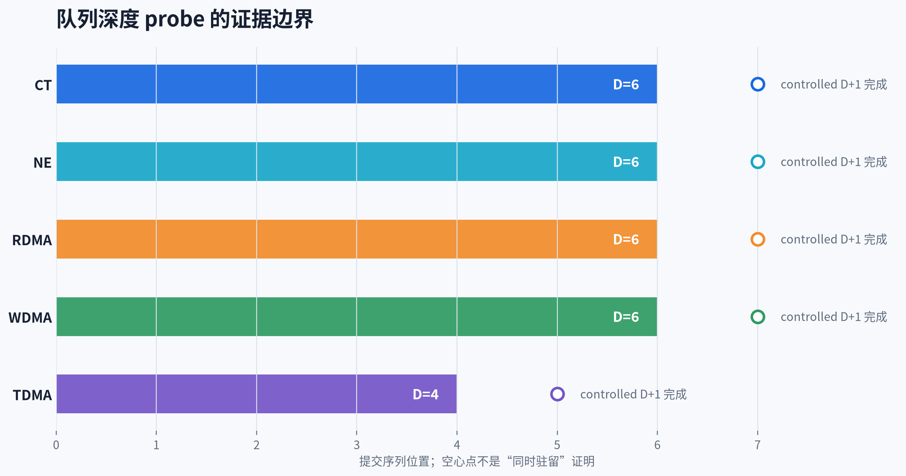
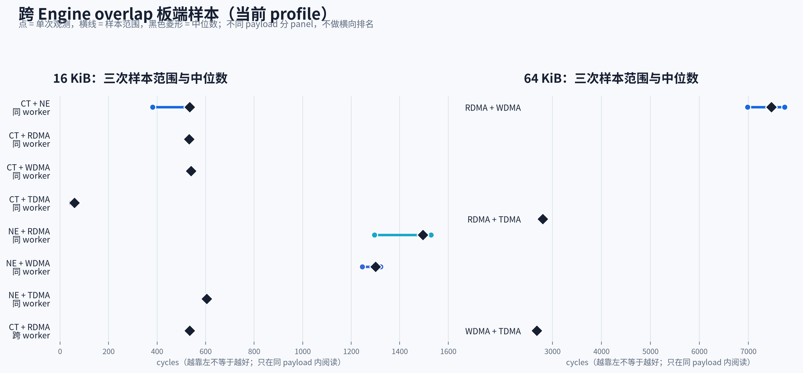
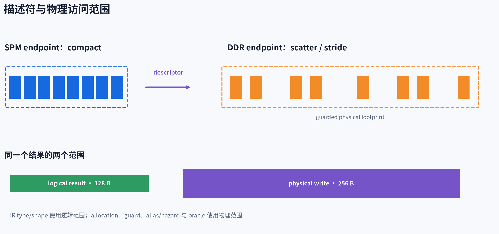
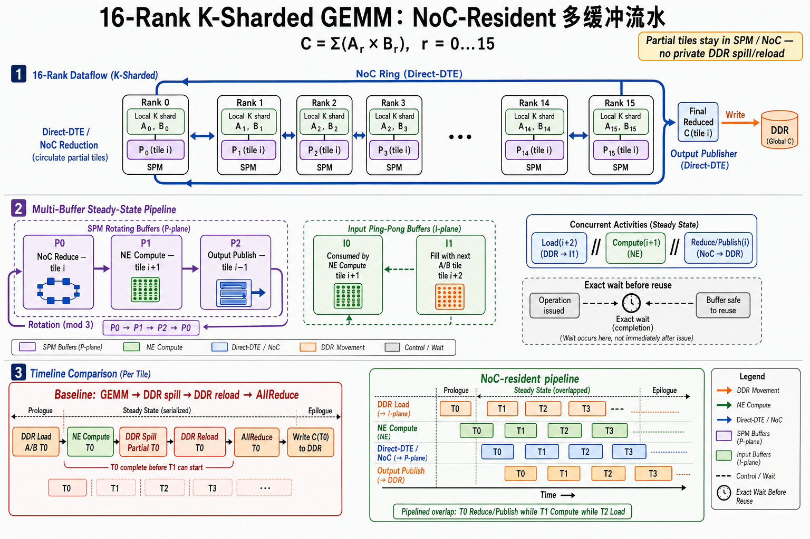

# TX81 当前 Profile：面向编译器开发者的硬件行为导读

本文把 `docs/tx81-compiler-hardware-calibration.md` 中已经确认、能直接约束编译器实现的结论，
整理成一份更便于日常阅读的硬件行为说明。它描述的是**当前板卡、固件和 runtime profile 下可观测到
的行为**，不是芯片微架构规格书，也不把当前看不到的内部状态推断成硬件事实。

## 1. 先记住这张行为地图



编译器面对的不是一条单一的“设备执行时间线”，而是几个彼此有关、又不能混为一谈的域：

- **提交域**：指令是否已经被 host/runtime 提交；
- **队列与驻留域**：多少工作已经进入某个 engine，不能从“成功提交”直接推出；
- **engine 完成域**：CT、NE、RDMA、WDMA、TDMA 各自有自己的进度和完成条件；
- **Direct DTE 完成域**：send issue、token wait、finish 组成独立生命周期；
- **逻辑数据域**：IR 中结果需要多少元素、多少字节；
- **物理访问域**：硬件描述符实际会读写哪些字节和 guard 区域。

这六件事如果被压成一个布尔值，编译器很容易提前复用 buffer、错误判断 overlap，或者写出不正确的
expected output。

## 2. 如何阅读结论

本文沿用四级证据标签：

| 标签 | 含义 | 编译器可以怎样使用 |
|---|---|---|
| `supported` | 软件/ABI 明确支持，且合同可验证 | 可用于 legality 和 lowering |
| `board-observed` | 当前 profile 的 fresh 板端 case 已观察到 | 可用于当前 profile 的 cost/heuristic，但要保留 profile 边界 |
| `unknown` | 当前观测手段无法区分 | 必须保守处理，不能补写猜测 |
| `excluded` | 已有证据排除该解释或用法 | verifier 或选择器应阻止 |

单个 probe case 只回答它的实验问题。例如 `D+1` 能完成，只说明 controlled sequence 可完成；它不证明
`D+1` 个命令能同时驻留，也不证明达到持续满吞吐。

## 3. Case A：队列深度是边界，不是调度窗口

当前 profile 下，controlled depth probe 的结果是：

| Engine | 观察到的深度 `D` | `D+1` controlled sequence | 不能推出 |
|---|---:|---|---|
| CT | 6 | 完成 | 同时驻留 7 个 |
| NE | 6 | 完成 | 持续满流水 |
| RDMA | 6 | 完成 | 无 backpressure |
| WDMA | 6 | 完成 | 无 backpressure |
| TDMA | 4 | 完成 | 与其它 engine 必然并行 |



编译器结论：software-pipeline window 不能写成“等于硬件队列深度”。实际窗口还要同时受以下条件约束：

1. buffer lifetime 和 reuse hazard；
2. producer/consumer dependency；
3. engine 资源和 completion token；
4. 当前 candidate 的 prologue/steady/epilogue 是否都合法。

因此，深度值适合作为 candidate 上界或 cost input，不适合作为单独的正确性证明。

## 4. Case B：跨 Engine 可以 overlap，但要分 payload 和完成域

下图使用校准文档中的三次板端观测值；点表示样本，横线表示样本范围，菱形表示中位数。16 KiB 和
64 KiB 是不同 payload，刻意分成两个 panel，不做跨 payload 排名。



当前 profile 的 `board-observed` 结论是：

- CT/NE 与 RDMA、WDMA、TDMA 的组合存在可持续 overlap 的板端证据；
- RDMA/WDMA 与 TDMA 的 64 KiB 组合也存在 overlap 证据；
- 4 KiB 的短 RDMA+WDMA case 中，FU excess 为 0，但计划周期仍下降约 490–890 cycles。这更像
  drain/finish 消除收益，不能据此宣称两个 engine 同时活跃。

编译器结论：cost model 应拆开“engine overlap”与“减少 drain/finish”两类收益；同一个总周期下降，
可能来自完全不同的机制。

## 5. Case C：Strided descriptor 的两端布局不对称



当前确认的描述符行为是：

- DDR endpoint 按 iterations/strides 形成 scatter/stride 访问；
- SPM endpoint 保持 compact；
- expected output 必须按**物理访问 footprint**生成，不能只按逻辑 tensor 形状展开。

旧 expected-result checker 把两端都按同一种展开方式解释，在三个 standalone case 中分别出现
26、32、44 个 mismatch。按 DDR 与 SPM 两端分别计算期望范围后，3 个 standalone 加 36 个
dependency case 共 39/39 精确匹配。

这个 case 的关键不是“修了测试”，而是把 compiler contract 说清楚：IR 里的逻辑形状、描述符的物理
访问、guard 区域分别由不同层负责。不能把旧 mismatch 解释成 cache 行为，也不能从名字推导布局。

## 6. Case D：逻辑结果范围不一定等于物理写回范围

reduce probe 中，逻辑结果是 128 B，而硬件可观察到的物理写回范围是 256 B。

同类问题也出现在 CT tail：130 个 FP16/BF16 元素的逻辑长度是 260 B，但当前已验证 case 需要保护
512 B physical span。两组数字说明 physical span 不是一个全局 256 B 常量，而是
`opcode/form/dtype/shape/tail/profile` 共同决定的 target fact。

编译器结论：

- logical result span 用于 IR type、shape 和用户语义；
- physical write span 用于分配、guard、alias/hazard 和 expected-output check；
- 任何需要保护相邻对象的 lowering，都必须使用物理范围。

这也是为什么 planner 必须从当前 IR 和目标 ABI 重算 footprint，而不能沿用上层 tensor 大小。

## 7. Case E：Direct DTE 是独立完成域

```mlir
%token = wafer.instr.dte_send %buffer
    {peer = 1 : i64, bytes = 16 : i64,
     message = #wafer.dte_message<
       communication = 9,        round = 2, slice = 0>}
    : memref<4xf32, #wafer.memory<spm, tensor>> -> !async.token
wafer.instr.dte_wait %token : !async.token
```

`send` 返回只表示 issue 生命周期已经建立。NCC wait、普通 barrier 或 host return 都不能替代
Direct DTE token 的 terminal wait/finish。

编译器结论：

- token 必须沿 SSA/控制流保留，直到能够证明完成；
- buffer reuse hazard 绑定 issue-time 的实际访问范围；
- `scf.for` 等控制流中的 token 需要显式携带，不能用 side table 或名字匹配恢复；
- lowering 需要保持 `prepare → issue → wait/release → finish` 的目标 ABI 顺序。


当前 Direct DTE qualification 还给出了一个重要的运行时边界：

- 正向 modes 1--6 已闭合 payload、status、completion 和 cleanup；
- modes 7/8/9/12 返回预期 transport error，并能正常结束当前 case；
- receiver 未 prepare 的 mode 13 会 timeout，并可能污染同一 execution context。

因此首个 timeout 后停止当前批次，不在同一 context 自动 retry、reset 或 power。管理面显示 idle、无残留
进程或后续 heartbeat，只能重新资格化新的 execution path，不能恢复 timeout 前未完成的证据。

## 8. Case F：Cache visibility 取决于 producer/consumer crossing

当前 profile 的 58/58 case 覆盖四个方向：

| Crossing | visibility 动作 |
|---|---|
| host H2D → Kcore read | Kcore 读取前 invalidate |
| Kcore store → NCC RDMA | RDMA 前 clean + fence |
| NCC WDMA → Kcore read | matching completion 后 invalidate |
| NCC WDMA → host | runtime D2H readback |

编译器结论：cache 不是 memory space 上的一个全局 `coherent=true/false` 属性。是否需要visibility操作
取决于实际 producer、consumer 和 crossing；pure NCC 链不应机械插入 Kcore cache 操作。当前结论针对
一次性 runtime lifecycle，不自动覆盖 persistent allocation 的跨 launch 复用。

## 9. Case G：Worker wait 只证明列出的 participant 已完成

当前 worker/completion 校准给出：

- same-worker RAW/WAR/WAW/RAR：24 个 case、72 个 sample 均通过；
- targeted worker wait：worker0/1/2 × NE/RDMA，18/18 正向 sufficiency；
- proper-subset join：12/12 中 mask 内 participant 均完成。

这些结果支持 same-worker issue order 和显式 participant join。`ncc_join [0, 2]` 可以 lower 为
`0b101`，但 mask 外 worker 在观察点常常已经自然排空，因此当前结果没有证明排他 scope。编译器不能据此
删除其它 IR dependency，也不能把 local fence 当成所有 worker 的隐式 join。

## 10. Case H：地址结果只支持到“当前映射”，不支持微架构归因

DDR tile-offset probe 覆盖 16 个 rank、14 个 offset、2 个 allocation，共 2688 个 guarded transfer，
当前 profile 下 exact。40 GiB sparse high-offset windows 也在当前 allocator/range 内 exact。

这些结果支持：

- 当前地址表达、allocator range 和 transfer lowering 可用；
- 当前 profile 的 offset 映射可进入 package/no-card/board expected-result check。

这些结果不支持：

- 把 relative offset 当成稳定物理类别；
- 推断 bank、controller 或 hop；
- 把当前 allocator 行为提升为跨固件/跨板卡的硬件规格。

## 11. Case I：字段可编码，不代表对应数学语义成立

ArgMin 的负值域行为不满足当前期望，应标为 `wrong/unsupported`；正值域只在已验证的窄范围内
`board-observed`。这类结论不能被“常见 workload 不会遇到”掩盖。

NE wrapper option 是另一个例子。当前已测 large GEMM 中，bias、ReLU、LeakyReLU 和 axis-scale option
没有改变输出；FP16 ReLU case 的 8192 个结果中仍有 3828 个负值，并且结果与 bare GEMM 逐 bit 相同。
ABI 能接受 option、packet 能完成，都不足以让 compiler 删除独立 activation 或 scale。

编译器结论：如果语义域不能保证，就应在 verifier/legality 或候选选择时拒绝，而不是依赖运行时偶然
输入。只有上游 IR 能证明落在已支持域，才可以采用这条 lowering。

## 12. Case J：历史 production candidate 证据的当前边界

下列 NoC-resident K-sharded GEMM 是旧 whole-rank compiler 已完成的板端证据，保留它是为了记录
当时 source→IR→package→board 的闭环，不是将 rank-oriented mapping、候选接口或 package wire 保留为
current compiler 合同：



- global `4096³` GEMM 在 16 ranks 上形成 local `K=256`；
- 每 rank 两个 2 MiB input shard，完整 replicated output 为 32 MiB；
- baseline 与 winner 各 3 次，合计 6/6 all-rank exact；
- winner 必须真实改变 accepted Instr、Target LLVM、ELF/package，并与同源 baseline 使用相同 expected、
  guard、completion 和 cleanup。

这组历史结果只覆盖当时的 FP16、16-rank fixture、已生成 candidate 和对应 profile。它不把一个
microbench 的队列、overlap 或地址观察提升为其它 shape、dtype、route 的通用性能结论；也不代签
current physical-dataflow spatial/temporal/fusion selection。current 路径必须重新产生actual CardModule、schema-v8 package
和fresh no-card/board证据。

## 13. 编译器实现检查表

在新增 target lowering、memory planner 或 software pipeline candidate 时，逐项确认：

- 我使用的是逻辑范围还是物理访问范围？
- completion 是否来自正确的 engine/token 域？
- overlap 收益是否真的有同时活跃证据，还是只省掉了 drain？
- queue depth 是上界、cost input，还是被误当成正确性条件？
- 地址/offset 结论是否超出了当前 profile 和 allocator 范围？
- 负值、边界 dtype、guard 区域是否进入 expected-result check？
- 当前 IR 能否通过 SSA、type、shape、memory space 和显式 attr 表达；若不能，是否应该扩 IR？
- 结论属于 `supported`、`board-observed`、`unknown` 还是 `excluded`？

## 14. 事实来源和更新规则

主事实源仍是：

- `docs/tx81-compiler-hardware-calibration.md`
- `tasks/06-physical-dataflow-synthesis.md`
- `tasks/plans/multi-engine-software-pipelining.md`
- `tasks/plans/noc-resident-tile-dataflow.md`
- 对应的当前测试和 lowering 代码

本导读只重排已经确认的事实，不替代校准矩阵或 ABI 合同。板卡、固件、runtime profile、描述符格式或
观测工具变化时，应先更新主事实源和 fresh 证据，再同步本导读。历史 raw/log 只保留审计价值，不作为
新结论的输入。
